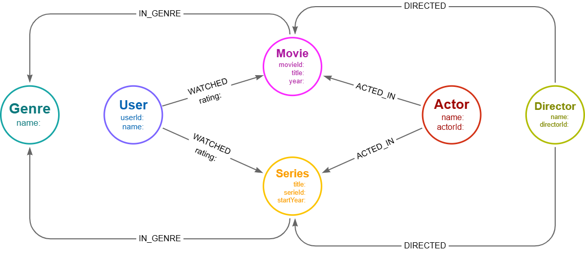
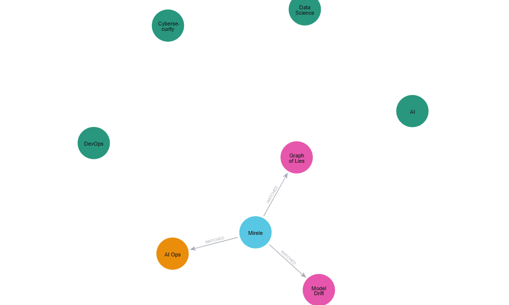
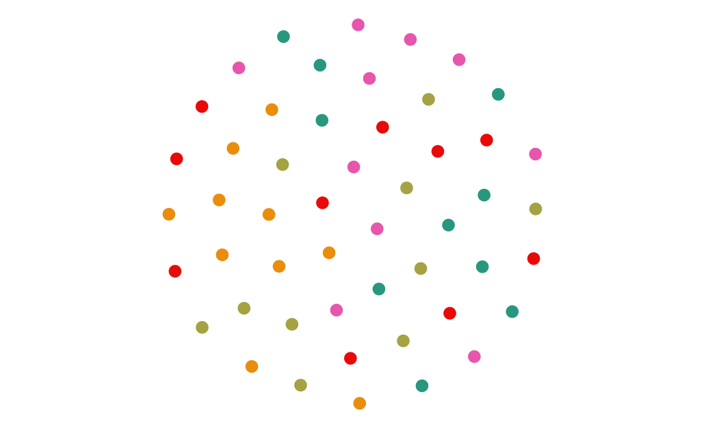
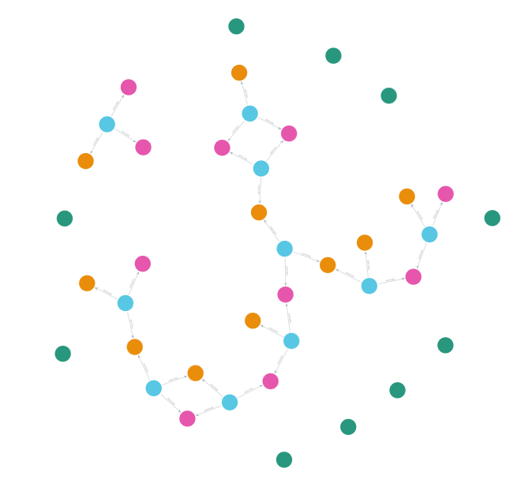

# 🎬 Streaming Service Graph Model (Neo4j)

Este projeto faz parte do laboratório **Graph Intelligence Lab** e foi desenvolvido como desafio prático do módulo **Modelagem de Bancos Baseados em Grafos** no bootcamp de Neo4j.

O objetivo é modelar um **serviço de streaming** utilizando grafos, priorizando **relacionamentos** para viabilizar sistemas de recomendação inteligentes.

---

## 🧩 Contexto do Problema

Você foi contratado por um novo serviço de streaming de filmes e séries.  
Diferente de bancos relacionais tradicionais, a empresa deseja utilizar **bancos de dados em grafos** para explorar conexões entre usuários, conteúdos e pessoas envolvidas na produção.

Esse modelo permite responder perguntas como:

- Quais filmes um usuário pode gostar com base no que já assistiu?
- Séries semelhantes às que ele avaliou bem
- Conteúdos relacionados por atores, diretores ou gêneros

---

## 🧱 Entidades (Nós)

O modelo inclui os seguintes nós, conforme especificação do desafio:

| Nó        | Descrição |
|----------|----------|
| `User`    | Usuários da plataforma |
| `Movie`   | Filmes disponíveis |
| `Series`  | Séries disponíveis |
| `Genre`   | Gêneros (ex: AI, Cybersecurity, Data Science) |
| `Actor`   | Atores |
| `Director`| Diretores |

Cada tipo possui **pelo menos 10 instâncias**, conforme exigido no desafio.

---

## 🔗 Relacionamentos

| Relacionamento | Origem → Destino | Propriedades |
|----------------|------------------|--------------|
| `WATCHED` | User → Movie / Series | `rating` |
| `ACTED_IN` | Actor → Movie / Series | — |
| `DIRECTED` | Director → Movie / Series | — |
| `IN_GENRE` | Movie / Series → Genre | — |

---

## 🧠 Modelagem Conceitual

Diagrama criado no **Neo4j Arrows**, representando o modelo lógico do grafo:

---

## 👤 Visão centrada no Usuário

Exemplo de como um usuário se conecta a conteúdos, gêneros e temas tecnológicos:

---

## 🎭 Atores, Diretores e Conteúdos

Relações entre atores, diretores, filmes e séries com foco em tecnologia:

---

## 🎯 Gêneros e Preferências

Exploração das preferências do usuário por gêneros como AI, DevOps, Cybersecurity e Data Science:

---

## 🚀 Diferencial do Projeto

Embora o desafio proponha um serviço genérico de streaming, este projeto foi modelado com **conteúdos temáticos de tecnologia**, preparando o terreno para:

- Sistemas de recomendação baseados em grafos
- Integração futura com IA (ex: Graph + LLM)
- Casos reais como a assistente **Zola**

---

## 🛠️ Tecnologias Utilizadas

- Neo4j (Community Edition)
- Cypher Query Language
- Neo4j Browser
- Neo4j Bloom
- Neo4j Arrows

---

## 📌 Próximos Passos

- Aplicar algoritmos de recomendação com **Graph Data Science (GDS)**
- Conectar o grafo a uma aplicação frontend
- Integrar com pipelines de IA (Zola)

---

👩‍💻 Projeto desenvolvido por **Mirele Alves**  
📚 Bootcamp Neo4j • Graph Intelligence Lab
