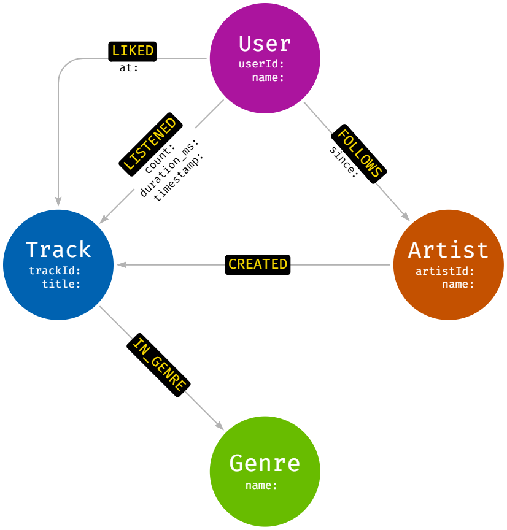
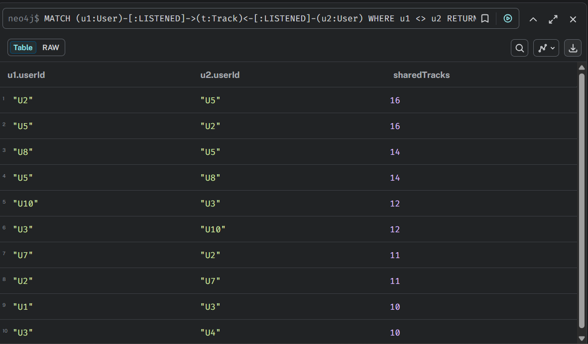
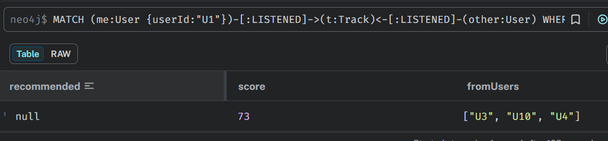
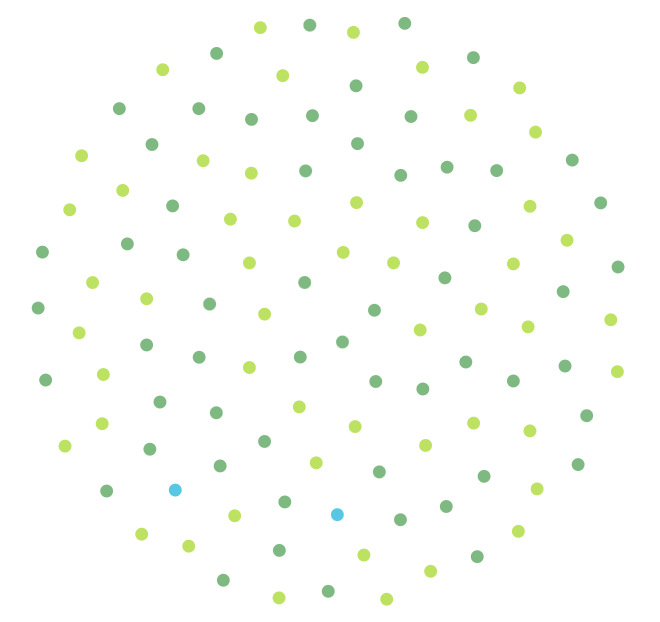
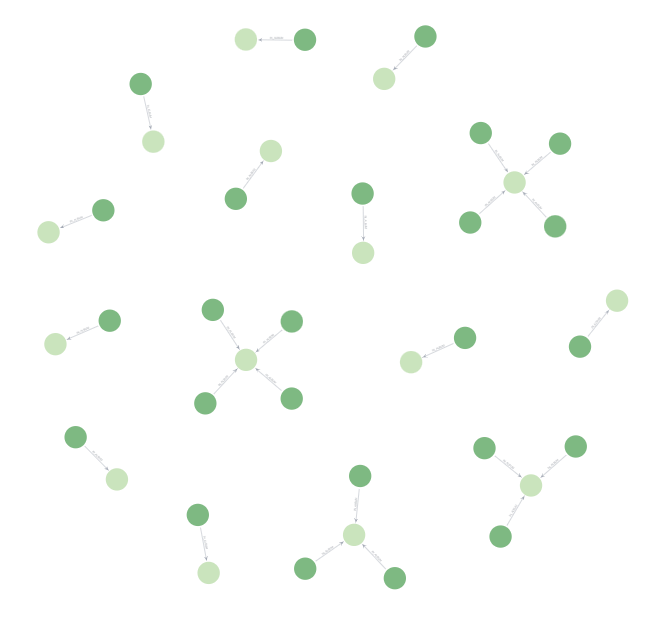
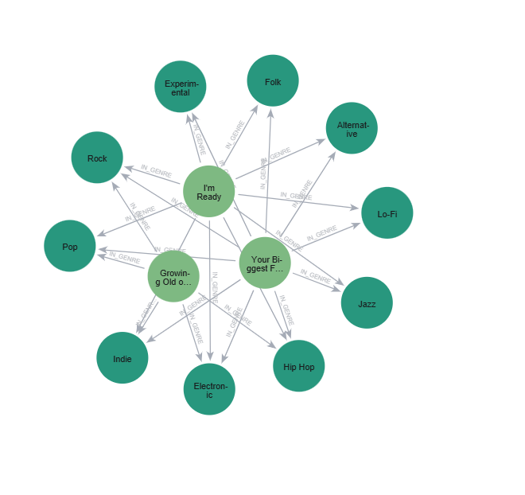
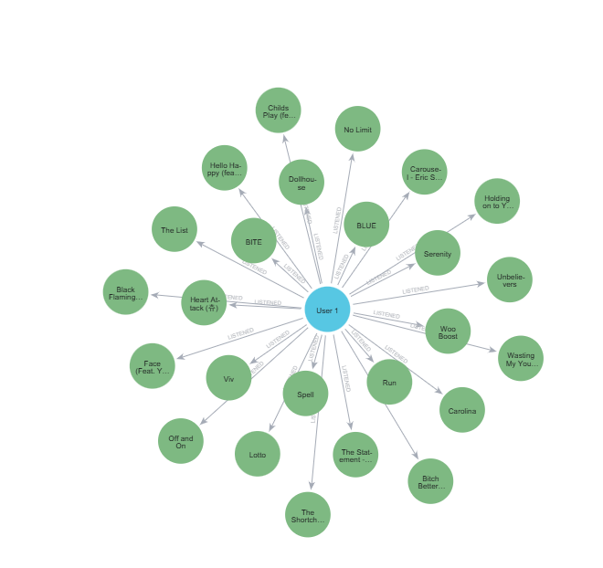

# 🎧 Graph Intelligence Lab  
### Sistema de Recomendação Musical com Neo4j

Este projeto utiliza **bancos de dados em grafos** para modelar o comportamento de escuta musical e gerar **recomendações personalizadas**, explorando conexões entre usuários, músicas, artistas e gêneros.

Desenvolvido com **Neo4j Aura** e **Cypher**, o projeto demonstra como grafos são ideais para sistemas de recomendação baseados em similaridade e comportamento coletivo.

---

## 🧠 Objetivo do Projeto

- Modelar um grafo de conhecimento para um serviço de streaming musical  
- Representar interações de usuários como relacionamentos com propriedades  
- Utilizar consultas Cypher para:
  - Identificar usuários com gostos semelhantes  
  - Gerar recomendações musicais  
  - Explorar padrões de escuta 

---

## 🗂️ Fonte de Dados

Os dados utilizados são baseados no dataset **My Spotify Listening History**, disponível no Kaggle e foram importados e modelados no **Neo4j Aura**.

---

## 🧱 Entidades (Nós)
O modelo foi construído com os seguintes nós:

| Nó     | Descrição |
|------|-----------|
| User  | Usuários da plataforma |
| Track | Músicas disponíveis |
| Artist | Artistas |
| Genre | Gêneros musicais |

Cada tipo de nó possui **no mínimo 10 instâncias**, conforme exigido no desafio.

---

## 🔗 Relacionamentos
Os principais relacionamentos modelados são:

| Relacionamento | Origem → Destino | Propriedades |
|---------------|------------------|--------------|
| LISTENED | User → Track | count, duration_ms, timestamp |
| LIKED | User → Track | at |
| CREATED | Artist → Track | — |
| IN_GENRE | Track → Genre | — |
| FOLLOWS | User → Artist | since |

---

## 🧠 Modelagem Conceitual
A modelagem foi construída no **Neo4j Arrows**, representando as conexões entre usuários, músicas, artistas e gêneros.

---

## 🔍 Resultados

### Similaridade entre usuários
Identificação de usuários com músicas em comum:

### Recomendações musicais
Sugestão de músicas baseada em usuários semelhantes:

### 📊 Visualização de relacionamentos nos grafos

| CREATED | IN_ALBUM | IN_GENRE  | LISTENED  |
|--------|----------|--------|----------|
|  |  |  |  |

---

## 🚀 Diferencial do Projeto
Embora o desafio proponha um serviço genérico de streaming musical, este projeto foi modelado com foco em **exploração analítica e sistemas de recomendação**, preparando a base para:

- Algoritmos de recomendação baseados em grafos
- Uso futuro do **Graph Data Science (GDS)**
- Integração com soluções de IA e assistentes inteligentes

---

## 🛠️ Tecnologias Utilizadas
- Neo4j (Aura / Community)
- Cypher Query Language
- Neo4j Browser
- Neo4j Bloom
- Neo4j Arrows

---

## 👩‍💻 Autora

**Mirele Alves**  
Projeto desenvolvido para estudos do Bootcamo da DIO em **Neo4j e Inteligência em Grafos**.
