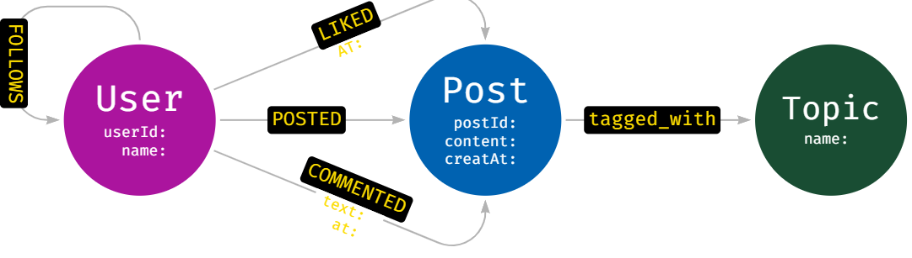
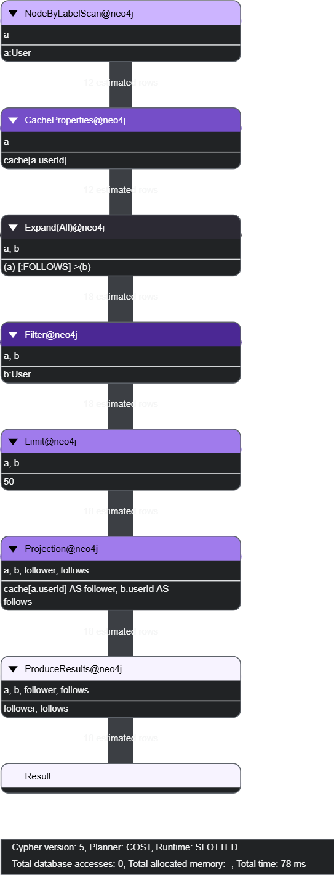
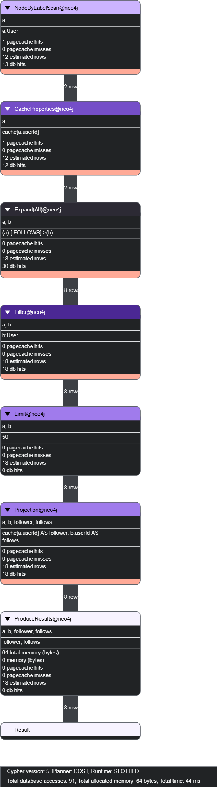
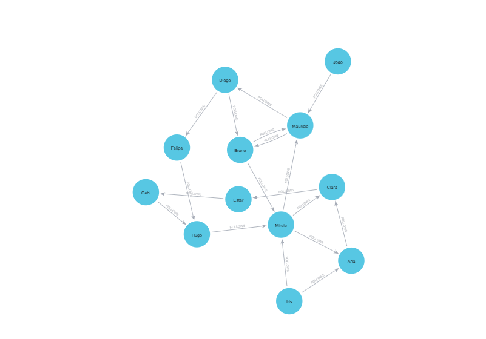
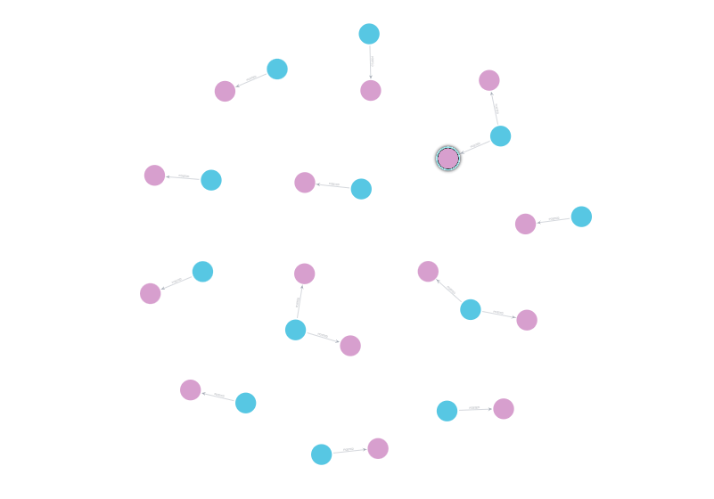
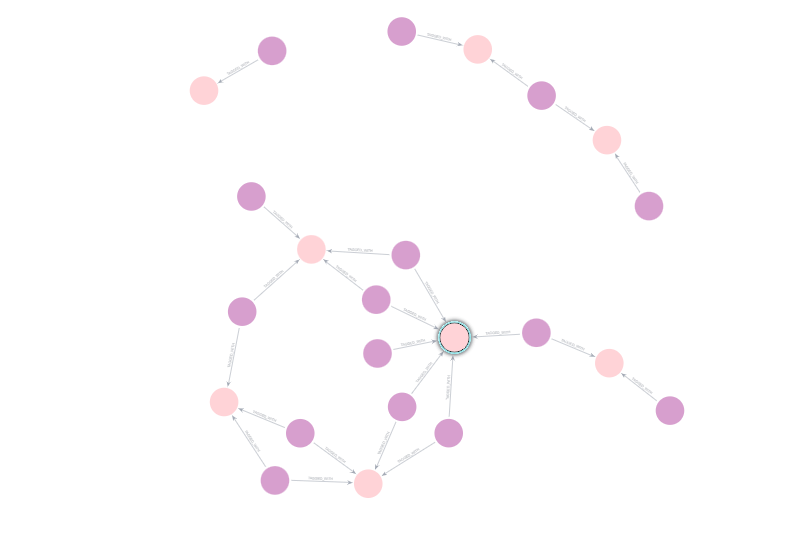
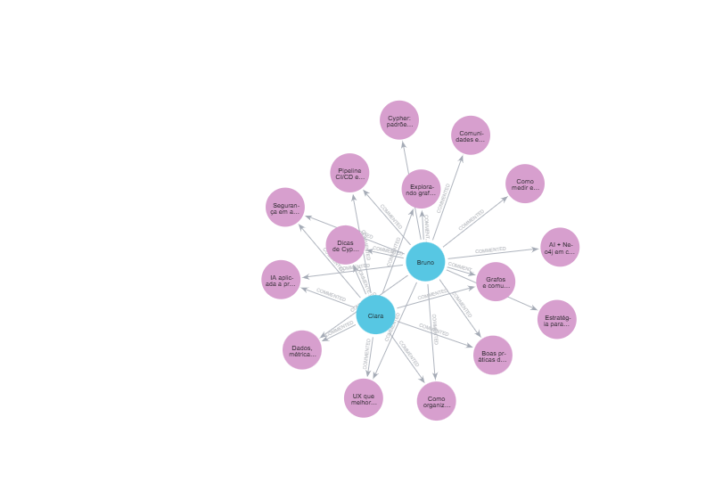
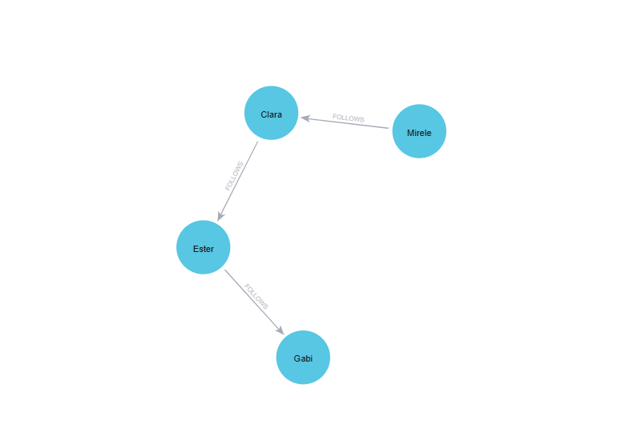
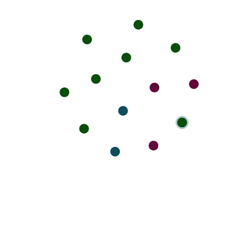

# 🌐 Social Network Graph Analysis (Neo4j)

Este projeto faz parte do **Graph Intelligence Lab** e foi desenvolvido como o terceiro desafio prático do módulo de **Modelagem e Análise de Grafos**, com foco em **redes sociais**.

O objetivo é construir um **protótipo funcional em Neo4j** capaz de responder perguntas complexas sobre conexões entre usuários, interações sociais e comunidades de interesse, utilizando **consultas em grafos**, `EXPLAIN` e `PROFILE`.

---

## 🧩 Contexto do Problema

Uma startup de análise de mídias sociais deseja criar um novo produto que ofereça **insights sobre engajamento e conexões entre usuários**.

Diferente de bancos relacionais, o uso de **bancos de dados em grafos** permite explorar:
- relações diretas e indiretas
- caminhos mínimos entre pessoas
- influência social
- popularidade de conteúdo
- formação de comunidades

---

## 🎯 Desafio Proposto

Utilizando os conhecimentos adquiridos no módulo, foi necessário:

- Modelar uma rede social como grafo
- Definir **constraints antes da carga**
- Carregar dados de forma consistente
- Formular **perguntas de negócio**
- Analisar consultas com `EXPLAIN` e `PROFILE`
- Visualizar padrões de relacionamento

---

## 🧱 Modelo de Dados

### Entidades (Nós)

| Nó    | Descrição |
|------|----------|
| User | Usuários da rede |
| Post | Conteúdos publicados |
| Topic | Tópicos de interesse |

### Relacionamentos

| Relacionamento | Origem → Destino | Propriedades |
|----------------|------------------|--------------|
| FOLLOWS | User → User | — |
| POSTED | User → Post | createdAt |
| LIKED | User → Post | at |
| COMMENTED | User → Post | text, at |
| TAGGED_WITH | Post → Topic | — |

---

## 🧠 Diagrama Conceitual do Grafo

---

## ⚙️ Análise de Consultas — EXPLAIN & PROFILE

Para compreender o comportamento das consultas, foram utilizadas as cláusulas
`EXPLAIN` (plano lógico) e `PROFILE` (execução real).
Permitindo entender como e com que eficiência a consulta é executada no grafo e analisar custo.

| EXPLAIN (*consulta*) | PROFILE (*execução*) |
|--------------|---------|
| 

 | 

 |

---

## 🔍 Perguntas Respondidas com Grafos

Este modelo permite responder perguntas como:

| Quem segue quem na rede? | Quem são os usuários, os posts e os topicos mais engajados? | Quais posts receberam mais interações? | 
|--------------|---------|--------------|
|  | | | 

|Quais tópicos geram mais engajamento? | Qual o **menor caminho entre dois usuários**?|Quem são os usuários, os posts e os topicos mais engajados?|
|---------|-------------|------------|
|| | |

---

## 🚀 Conclusão

Este projeto demonstra como grafos são ideais para modelar **redes sociais**, permitindo análises profundas de relacionamento, influência e engajamento.

A abordagem facilita:
- exploração de conexões indiretas
- análise de comunidades
- uso futuro de algoritmos de grafos
- integração com IA e sistemas de recomendação

---

## 👩‍💻 Projeto desenvolvido por

**Mirele Alves**  
Bootcamp da DIO de Neo4j • Graph Intelligence Lab

